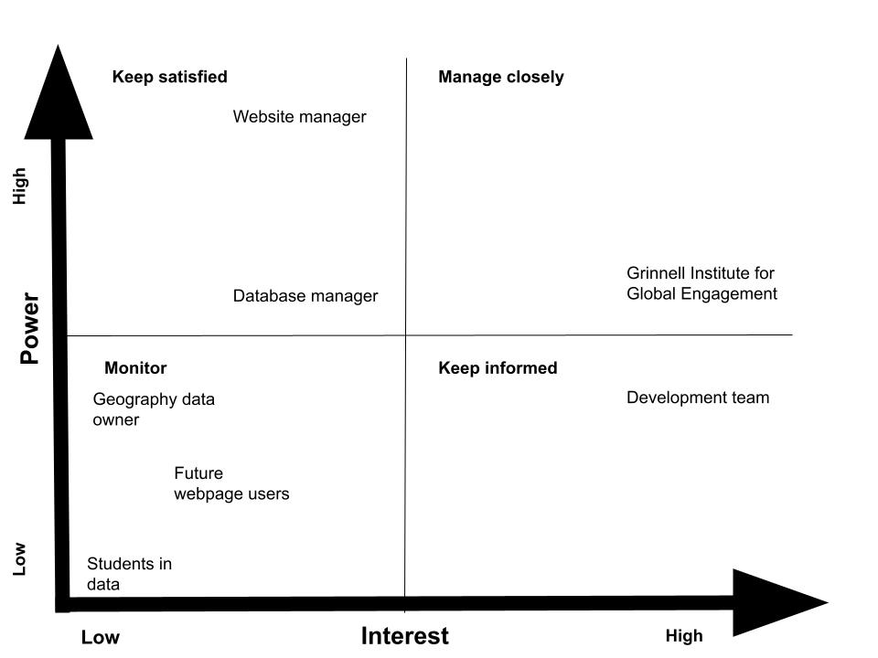

\newpage

# Table of contents

1. Project Overview \newline
2. Stakeholder map \newline
3. Functionality \newline
4. Insights \newline
5. Wish List \newline
6. References \newline 
7. Appendix: Memorandum of Understanding

\newpage

# Project Overview

The purpose of the project is to visualize data of previous visits by students to different countries off campus. This would ideally be used for the off-campus study webpage.

This is made for students and future students of Grinnell who are interested about its off-campus study programs and want to learn more about them.

We work with `three different data sets`.

The `first` is a data set of all the trips students have taken abroad since 2016. It includes information about the city and country, the program, when the trip happened, and the gender of the student.

The `second` is a data set of only the currently active programs, their city and country, and links to their webpages.

The `third` is a data set of active programs and their cost comparison to Grinnell and the estimated need provided.

The `goal` was to `visualize the first and second data sets overall as well as different features of the different data sets`. \newline
We came up with seven visualizations: a map of where students study and on what programs, a line chart of what regions students study in over time, a bar chart of how many students study abroad each semester, a bar chart of the number of students of different ethnicities that have studied abroad in each region, a bar chart of the gender of students that have studied in each country, and a bar chart of the different programs and their cost compared to Grinnell.

\newpage

# Stakeholder Map

\newline
Notes:

The Institute for Global Engagement (IGE) department are the community partner.

We are the development team.

The website manager is whoever would be responsible for putting our app on Grinnell's website.

The geography data owner is the owner of the free, publicly available geography information we used to make our map.

The future webpage users are the students/prospective students who would use our webpage.

The students in the data are those who have studied abroad in the past.

\newpage

# Functionality

### UI

A single page needs to organize and show the six different visualizations.

### Viz 1: Trip count map

The map needs to show the number of visits to different countries.

It needs to show which cities have been visited.

The cities need to link to the program that went there.

### Viz 2: Visits to regions over time

The chart needs to show trip counts to regions overtime by year.

The visits to different regions need to be separated.

Different regions must be able to be included or excluded.

### Viz 3: Visits abroad by year

The chart needs to show number of visits abroad overtime by year.

### Viz 4: Visits to country by ethnicity

The chart needs to show trip counts to different countries by ethnicity.

The visits to different regions need to be able to be included or excluded.

### Viz 5: Visits to country by gender

The chart needs to show number of visits to countries by gender.

The visits to different regions need to be able to be included or excluded.

### Viz 6: Cost of attendence by program

The chart needs to show programs by cost of attendance.

The programs need to show available need-based aid.

# Insights 

1. The biggest insight is that Europe is the most popular off-campus study location at Grinnell College. 

2. There were little to no students studying abroad in the academic year of 2020-2021 due to the COVID-19 pandemic. 

3. Grinnell College has provisions for students to access need-based financial aid for all off-campus programs that are higher in cost than a semester at Grinnell College. 

4. Females tend to study off-campus more than males. 

5. White students tend to study off-campus more other races.  

6. Students tend to study off-campus more in the fall semester than the spring semester. 

# Wish List

1. Make the financial visualization more user-friendly by allowing users to filter by region. 

2. Make the line chart more easy to understand by making changes in the appearance or choosing a different visualization to represent the data. 

3. Make the map have animations like a time slider such that users can see changes in where people studied throughout the years. 

4. Have better scaling to scale down the large values of Europe data to make the visualizations more aligned with each other. 

\newpage

# References 

[1] C. Beeley, Web Application Development with R Using Shiny, 2nd ed. Birmingham, UK: Packt Publishing, 2016.

[2] T. Munzer, Visualization Analysis & Design, New York, NY, USA: CRC Press, 2015.

[3] J. Cheng, B. Schloerke, B. Karambelkar, and Y. Xie. "Add markers to leaflet." Rstudio.github.io. Accessed: April 17, 2024. [Online.] Available: https://rstudio.github.io/leaflet/articles/markers.html
 
\newpage

# Appendix 

